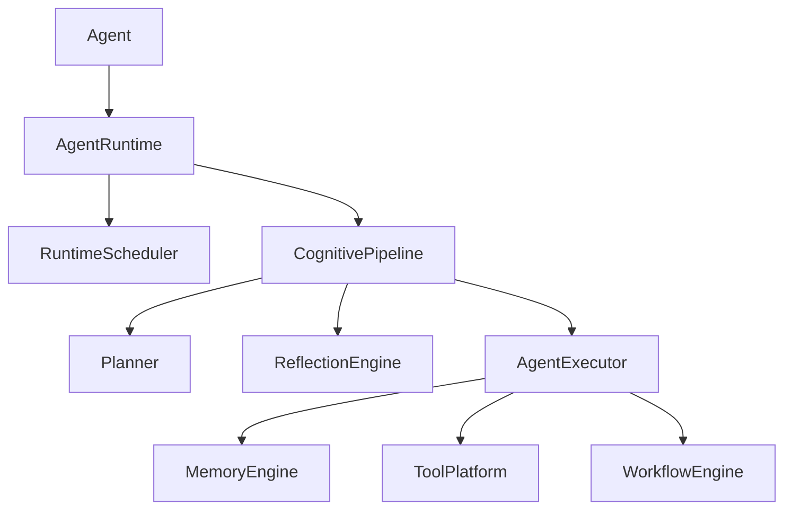
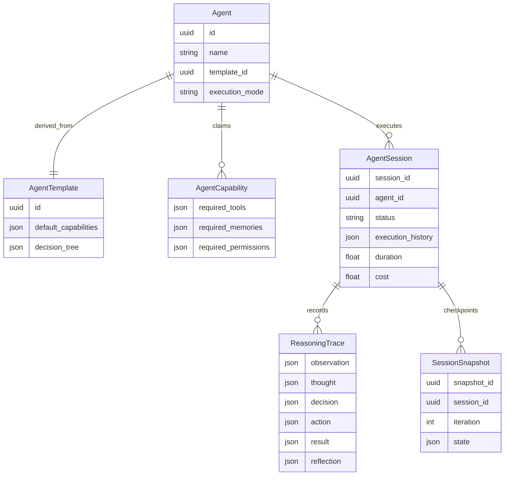
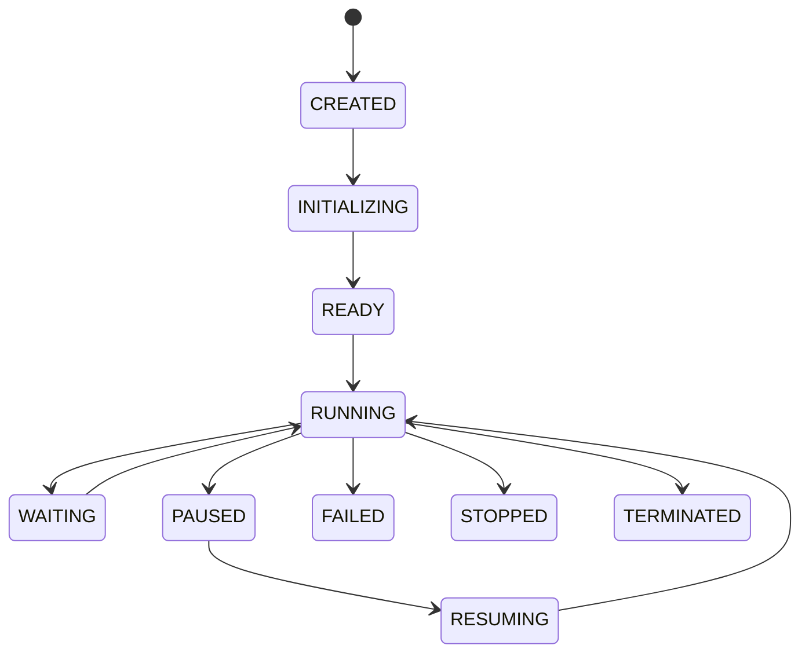

# Agent Runtime Platform

## High-Level Architecture
The Agent Runtime acts as the isolation sandbox for individual intelligent agents. It strictly decouples business logic from execution pipelines. The architecture enforces interactions via the `CognitivePipeline` and restricts external touches via the `AgentPolicy` and `AgentExecutor`.

## Entity Relationship Diagram

## Lifecycle State Machine

## APIs
`POST /api/v1/agents`
`POST /api/v1/agents/{id}/start`
`GET /api/v1/agents/{id}/replay`
