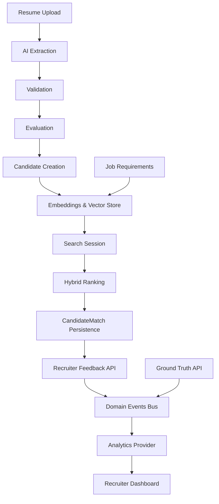
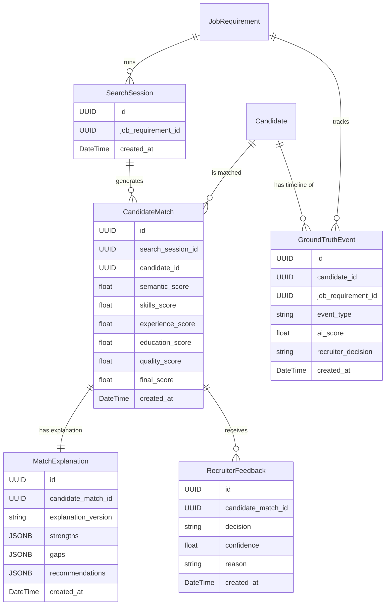
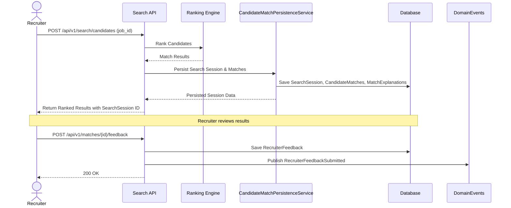

# Architecture Diagrams

## 1. System Architecture

```mermaid
graph TD
    Resume[Resume Upload] --> Extraction[AI Extraction]
    Extraction --> Validation[Validation]
    Validation --> Evaluation[Evaluation]
    Evaluation --> CandidateCreation[Candidate Creation]
    CandidateCreation --> Embeddings[Embeddings & Vector Store]
    
    JobReq[Job Requirements] --> Embeddings
    
    Embeddings --> SearchSession[Search Session]
    SearchSession --> CandidateRanking[Hybrid Ranking]
    CandidateRanking --> PersistMatch[CandidateMatch Persistence]
    
    PersistMatch --> RecruiterFeedback[Recruiter Feedback API]
    RecruiterFeedback --> DomainEvents[Domain Events Bus]
    
    GroundTruthAPI[Ground Truth API] --> DomainEvents
    
    DomainEvents --> AnalyticsProvider[Analytics Provider]
    AnalyticsProvider --> Dashboard[Recruiter Dashboard]
```

## 2. Entity Relationship (ER) Diagram

```mermaid
erDiagram
    SearchSession ||--o{ CandidateMatch : "generates"
    JobRequirement ||--o{ SearchSession : "runs"
    Candidate ||--o{ CandidateMatch : "is matched"
    CandidateMatch ||--|| MatchExplanation : "has explanation"
    CandidateMatch ||--o{ RecruiterFeedback : "receives"
    Candidate ||--o{ GroundTruthEvent : "has timeline of"
    JobRequirement ||--o{ GroundTruthEvent : "tracks"

    SearchSession {
        UUID id
        UUID job_requirement_id
        DateTime created_at
    }

    CandidateMatch {
        UUID id
        UUID search_session_id
        UUID candidate_id
        float semantic_score
        float skills_score
        float experience_score
        float education_score
        float quality_score
        float final_score
        DateTime created_at
    }

    MatchExplanation {
        UUID id
        UUID candidate_match_id
        string explanation_version
        JSONB strengths
        JSONB gaps
        JSONB recommendations
        DateTime created_at
    }

    RecruiterFeedback {
        UUID id
        UUID candidate_match_id
        string decision
        float confidence
        string reason
        DateTime created_at
    }

    GroundTruthEvent {
        UUID id
        UUID candidate_id
        UUID job_requirement_id
        string event_type
        float ai_score
        string recruiter_decision
        DateTime created_at
    }
```

## 3. Feedback Workflow Sequence Diagram

```mermaid
sequenceDiagram
    actor Recruiter
    participant API as Search API
    participant Engine as Ranking Engine
    participant Persistence as CandidateMatchPersistenceService
    participant DB as Database
    
    Recruiter->>API: POST /api/v1/search/candidates (job_id)
    API->>Engine: Rank Candidates
    Engine-->>API: Match Results
    API->>Persistence: Persist Search Session & Matches
    Persistence->>DB: Save SearchSession, CandidateMatches, MatchExplanations
    Persistence-->>API: Persisted Session Data
    API-->>Recruiter: Return Ranked Results with SearchSession ID
    
    Note over Recruiter, DB: Recruiter reviews results
    
    Recruiter->>API: POST /api/v1/matches/{id}/feedback
    API->>DB: Save RecruiterFeedback
    API->>DomainEvents: Publish RecruiterFeedbackSubmitted
    API-->>Recruiter: 200 OK
```
