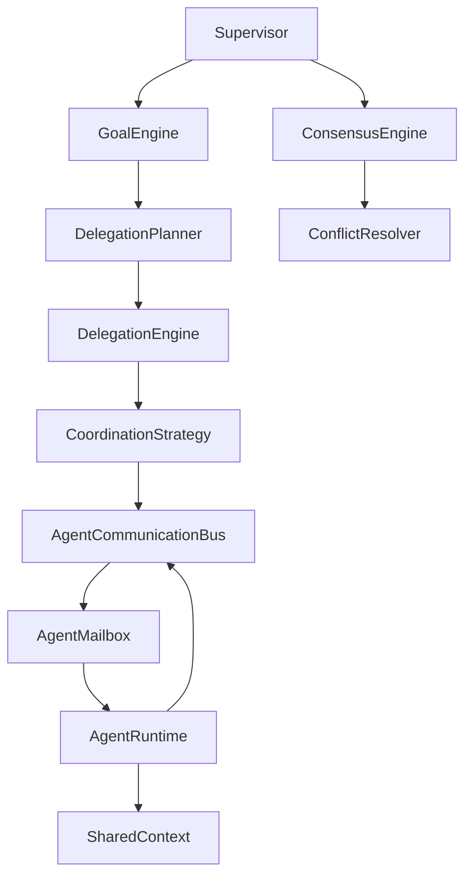
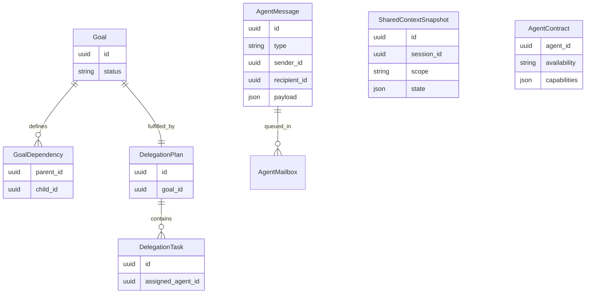
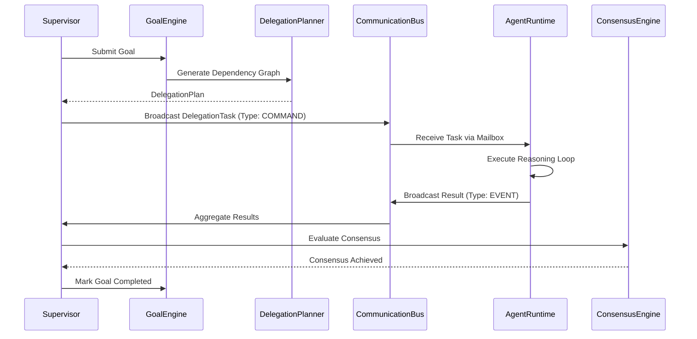

# Multi-Agent Coordination Platform

## High-Level Architecture
The Coordination Platform handles distributed orchestration of multiple agents. `Supervisor` operates strictly on `Goals`, mapping them via the `GoalEngine` into dependency graphs. The `DelegationPlanner` and `DelegationEngine` construct tasks and route them to agents via the `AgentCommunicationBus`. Agents never execute code against each other—they only interact by modifying `SharedContext` and sending `AgentMessage`s over the bus.

## Entity Relationship Diagram

## Sequence Diagram: Coordination Loop

## API Contracts
- `POST /api/v1/coordinator/start`
- `GET /api/v1/coordinator/status`
- `GET /api/v1/coordinator/messages`
- `GET /api/v1/agents/contracts`
