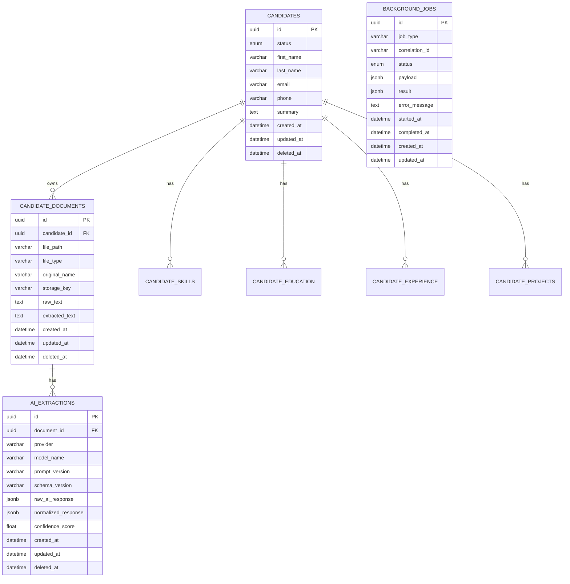

# Database Schema

The AI Recruiting Copilot backend uses PostgreSQL as the primary data store. The schema is built using SQLAlchemy 2.0 ORM. All primary keys are UUIDs, and tables feature soft-delete capability via `deleted_at`.

## Entity Relationship Diagram

