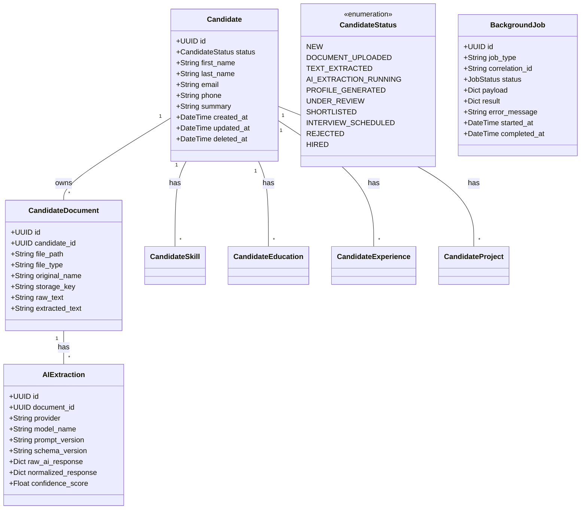

# Domain Model

The Domain Layer encapsulates the core business rules. It contains entities, value objects, and repository/provider contracts.

## Class Diagram

```mermaid
classDiagram
    class Candidate {
        +UUID id
        +CandidateStatus status
        +String first_name
        +String last_name
        +String email
        +String phone
        +String summary
        +DateTime created_at
        +DateTime updated_at
        +DateTime deleted_at
    }
    
    class CandidateStatus {
        <<enumeration>>
        NEW
        DOCUMENT_UPLOADED
        TEXT_EXTRACTED
        AI_EXTRACTION_RUNNING
        PROFILE_GENERATED
        UNDER_REVIEW
        SHORTLISTED
        INTERVIEW_SCHEDULED
        REJECTED
        HIRED
    }

    class CandidateDocument {
        +UUID id
        +UUID candidate_id
        +String file_path
        +String file_type
        +String original_name
        +String storage_key
        +String raw_text
        +String extracted_text
    }
    
    class AIExtraction {
        +UUID id
        +UUID document_id
        +String provider
        +String model_name
        +String prompt_version
        +String schema_version
        +Dict raw_ai_response
        +Dict normalized_response
        +Float confidence_score
    }

    class BackgroundJob {
        +UUID id
        +String job_type
        +String correlation_id
        +JobStatus status
        +Dict payload
        +Dict result
        +String error_message
        +DateTime started_at
        +DateTime completed_at
    }
    
    Candidate "1" -- "*" CandidateDocument : owns
    CandidateDocument "1" -- "*" AIExtraction : has
    Candidate "1" -- "*" CandidateSkill : has
    Candidate "1" -- "*" CandidateEducation : has
    Candidate "1" -- "*" CandidateExperience : has
    Candidate "1" -- "*" CandidateProject : has
```
