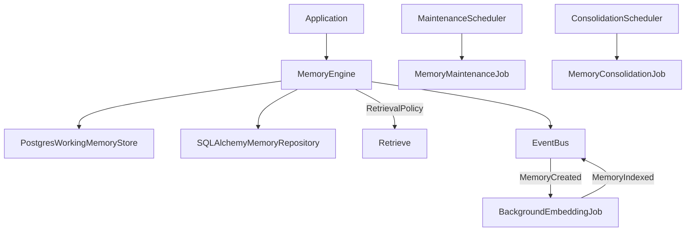
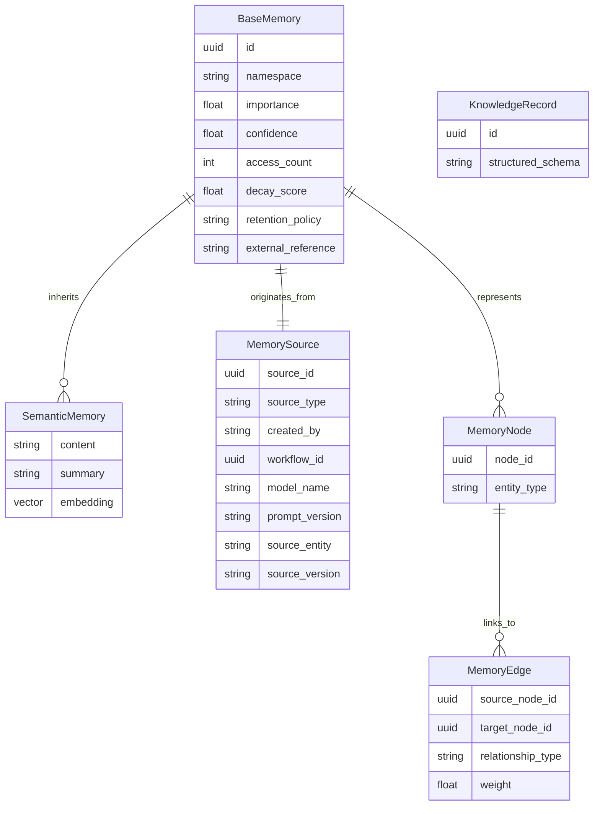

# Memory Architecture & Engineering

## High-Level Lifecycle
The lifecycle of all memories traversing the system follows a strict progression:
**Capture** → **Index** → **Retrieve** → **Consolidate** → **Archive** → **Expire**

## Entity Relationship Diagram

## Retrieval Policies & Context
Retrieval operations are explicitly governed by a `RetrievalPolicy` (e.g. `HybridRetrievalPolicy`, `SemanticRetrievalPolicy`, `RecencyRetrievalPolicy`).

Instead of returning raw models, `retrieve()` returns a `MemoryContext` object containing:
- `retrieved_memories`
- `retrieval_strategy`
- `retrieval_reason`
- `confidence`
- `search_statistics`
- `warnings`
- `missing_context`

## Maintenance & Consolidation
The platform supports two massive background operations:
1. **MemoryConsolidationJob**: (1) Insight Extraction, (2) Deduplication, (3) Summarization, (4) Memory Creation.
2. **MemoryMaintenanceJob**: Handles duplicate detection, decay recalculation, stale cleanup, embedding regeneration, and graph integrity validation.
