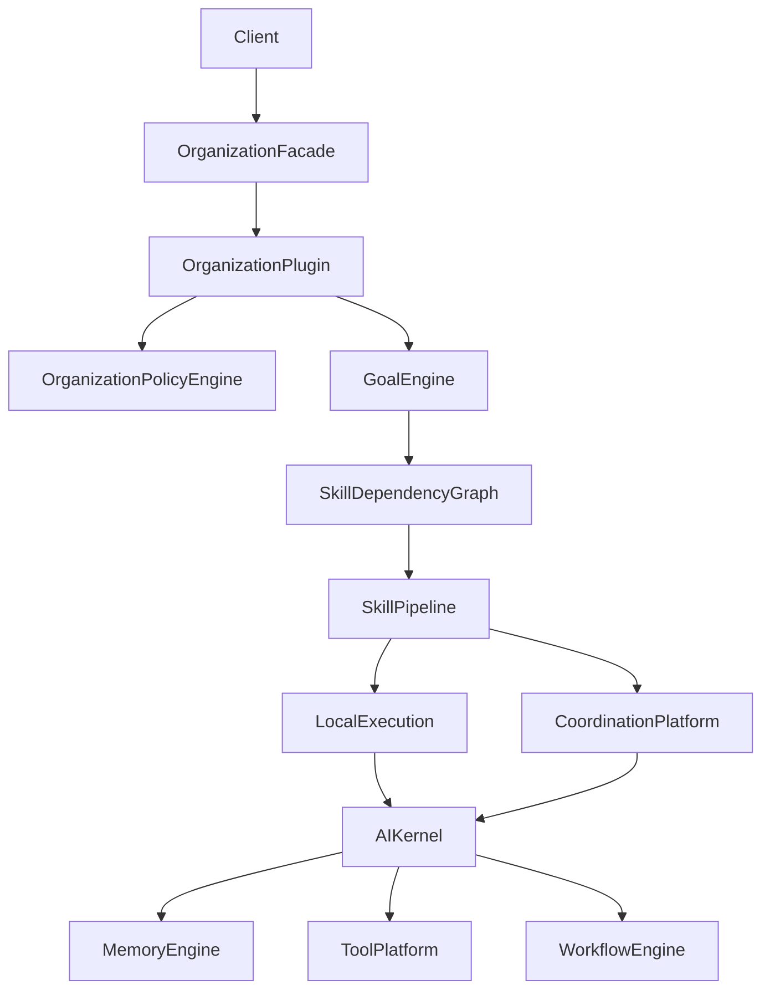
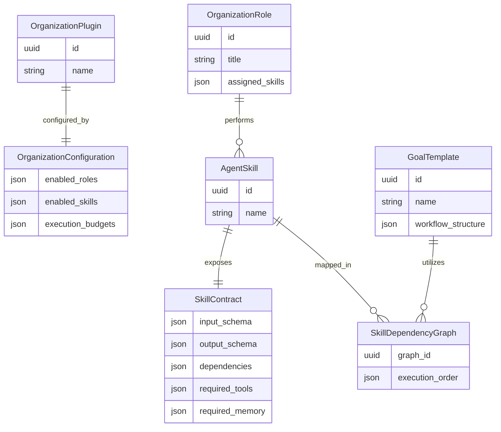
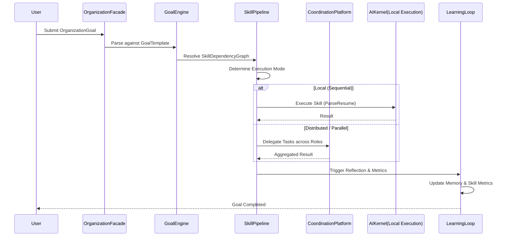

# Organization Architecture

## High-Level Architecture
The `RecruitingOrganization` is an implementation of an `OrganizationPlugin`. It sits atop the execution-scoped `AIKernel`, mapping high-level HR goals into discrete `AgentSkills` assigned to `OrganizationRoles`. 

## Entity Relationship Diagram

## Sequence Diagram: Goal Execution

## API Contracts
- `POST /api/v1/organization/goals`
- `GET /api/v1/organization/skills`
- `GET /api/v1/organization/metrics`
