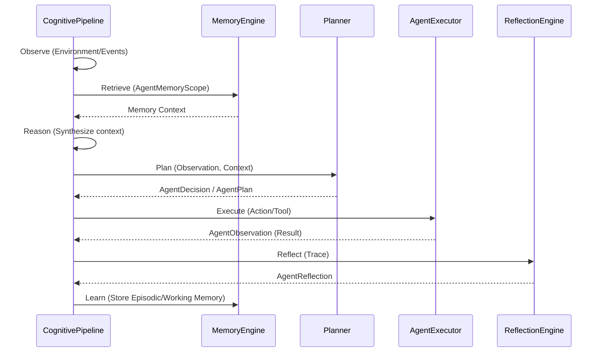

# Cognitive Pipeline (Reasoning Loop)

## Overview
Every iteration of an agent's execution is governed by the `CognitivePipeline`. It forces a strict procedural reasoning state machine, yielding a complete `ReasoningTrace`.

## Sequence Diagram

## Explanation of Stages
1. **Observe**: Intake environmental events, active tasks, or workflow statuses.
2. **Retrieve**: Ask `MemoryEngine` for semantic/procedural memory restricted by `AgentMemoryScope`.
3. **Reason**: Assemble internal thoughts.
4. **Plan**: Planner dictates the next sequence.
5. **Execute**: `AgentExecutor` fires the tool or triggers a state update.
6. **Reflect**: Evaluate if the executed action achieved the goal.
7. **Learn**: Update `WorkingMemory` and persist `SessionSnapshots`.
