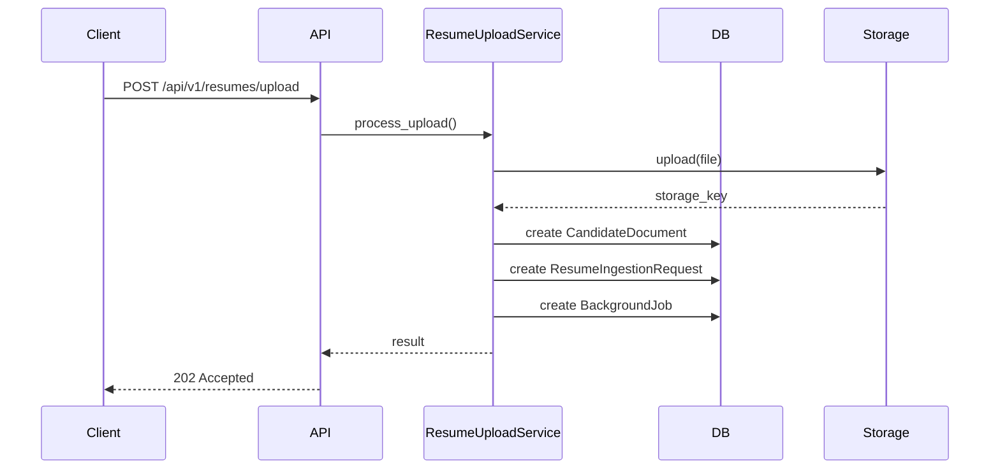

# Resume Ingestion Workflow

The Resume Ingestion pipeline is responsible for accepting PDF/DOCX files, storing them securely, and dispatching extraction jobs.

## Workflow Sequence

1. **Client Upload**: The user uploads a resume file (`POST /api/v1/resumes/upload`).
2. **Validation**: The API layer validates MIME types and file size (max 10MB).
3. **Storage**: The `LocalStorageProvider` saves the file into the `/storage/candidate-documents` volume.
4. **Persistence**:
   - A `CandidateDocument` is created (without `candidate_id` since extraction hasn't happened).
   - A `ResumeIngestionRequest` is created to track the entire ingestion lifecycle.
   - A `BackgroundJob` is created with a `QUEUED` status.
5. **Dispatch**: The job is dispatched via `JobDispatcher`.
6. **Response**: A `202 Accepted` is returned with `ingestion_id`, `document_id`, and `job_id`.

## Diagram

