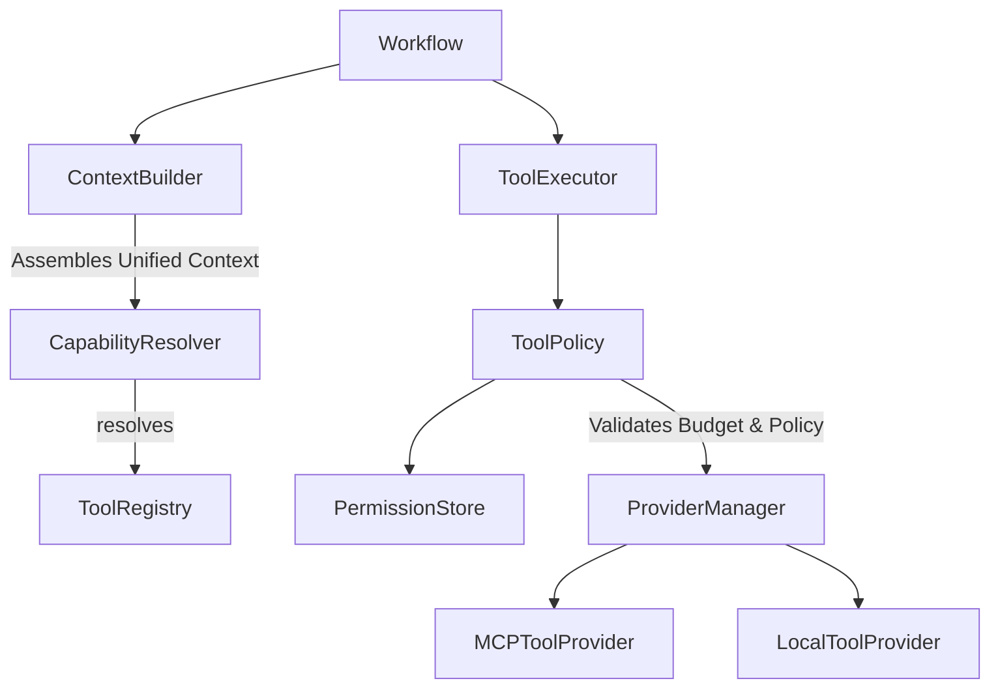
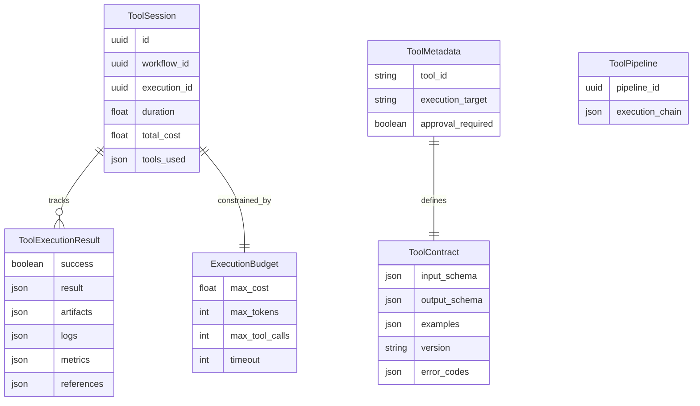
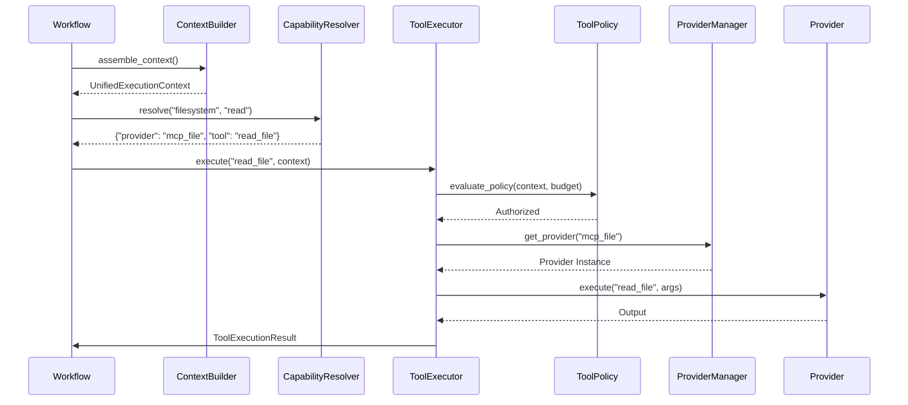

# Enterprise Tool Platform Architecture

## High-Level Execution Flow
Workflows request operations via capabilities. The system dynamically resolves, secures, and executes the capability via independent providers. The `ContextBuilder` pre-assembles all execution parameters before invoking the `ToolExecutor`.

## Entity Relationship Diagram

## Sequence Diagram: Tool Execution

